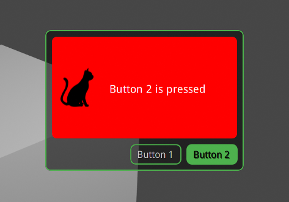

[](https://badge.fury.io/py/alleycat-ui)
# AlleyCat UI
A lightweight GUI widget toolkit for [UPBGE](https://github.com/UPBGE/upbge)
(_Uchronia Project Blender Game Engine_) based on [Cairo](https://www.cairographics.org/).



## Introduction

_AlleyCat UI_ is a lightweight GUI toolkit which means it doesn't rely on native peers, 
like Blender objects or any of its GUI related APIs.

It doesn't necessarily mean that it'd be faster in performance or lighter in memory 
consumption than those that do. However, being lightweight has its certain benefits too.

Because there is no native object to worry about, it is relatively easy to create a new 
type of components or extend the existing ones. Basically, you can make anything as 
long as you can draw it as an image, and the library exposes a _Cairo_ context which 
provides many useful features to paint shapes.

## Install

The library can be installed using `pip` as follows:
```shell script
pip install alleycat-ui
```

You will need to have _Cairo_ library in your library path in order for _AlleyCat UI_ 
to work. Linux users can install it using a package manager while on Windows, you may 
get it from [here](https://github.com/preshing/cairo-windows) (rename it to `libcairo-2.dll`
and put it where Python looks for native libraries, like the value of `PATH` environment 
variable).

## How to Use

To use UI components provided by _AlleyCat UI_, you need to create a proper context 
first. In most cases, you can use `alleycat.ui.blender.UI` to create a new context:

```python
from alleycat.ui.blender import UI

context = UI().create_context()
```

Then you can use this context instance to create UI components, like labels and buttons 
like this:

```python
from alleycat.ui import Label, LabelButton
from alleycat.ui.blender import UI

context = UI().create_context()

label = Label(context, text_size=18)
button = LabelButton(context, text="Button 1", text_size=16)
```

An important thing to remember is that only those components whose hierarchy is attached 
to an active `Window` can be rendered on screen. For example, if you create a `Panel` 
and add a `Label` to it, they won't be visible until you add the parent panel to an 
existing window.

If you want to create a window like popups or frames, you can use `Frame` which can be 
optionally configured to be draggable and resizable. On the other hand, if you just want 
to add components to the screen, you can use an `Overlay` instead, which is a transparent 
window that is automatically resized to fill the current screen:

```python
from alleycat.ui import Bounds, Label, Overlay
from alleycat.ui.blender import UI

context = UI().create_context()

overlay = Overlay(context)

label = Label(context, text="My Label", text_size=18)
label.bounds = Bounds(10, 10, 180, 40)

overlay.add(label)
```

When you are done using the UI, you need to destroy the context by invoking its
`dispose()` method. It is not strictly necessary if you are running the project with 
`blenderplayer`, but it may cause a crash if you run it inside Blender and stop the engine 
without properly disposing the context.

## Status

The project is in a very early stage of development and only provides a minimal set of 
components and layout managers. Admittedly, the documentation is not sufficient to guide 
new users to get started with the library at the moment.

I will try to keep adding more components and enhancing the documentation. But for now, 
I'd encourage you to take a look at the test cases to get a better idea of how to use each 
APIs.

Please use it at your own risks. If you have any questions about the project, feel free 
to visit [UPBGE Discord server](https://discord.gg/Mnw67yB) and ask `mysticfall#4102` 
for support.

## License
This project is provided under the terms of _[GNU General Public License v3 (GPL3)](LICENSE)_.
